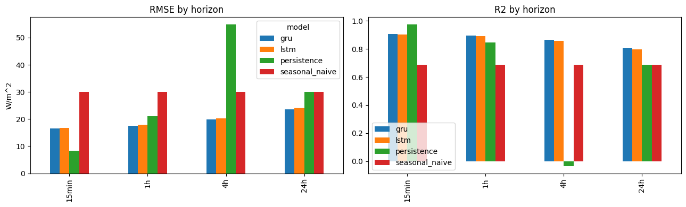
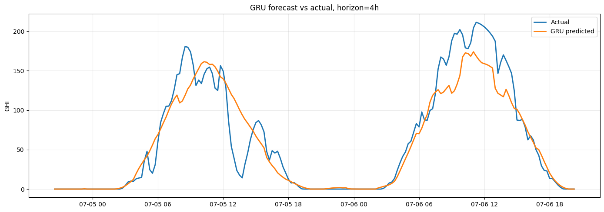
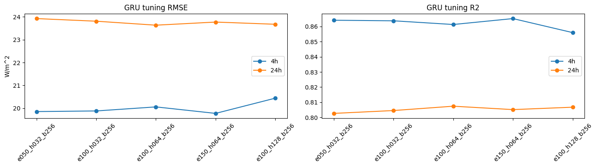

# Solar Irradiance Forecasting

Reproducible solar Global Horizontal Irradiance (GHI) forecasting with a leakage-safe preprocessing pipeline, simple time-series baselines, and compact PyTorch LSTM/GRU models.

The project is designed as a portfolio-ready ML repository: a reviewer can clone it, install it, run tests, and execute a small end-to-end comparison without needing private local files or a GPU.

## What This Project Shows

- Chronological time-series splitting for train/validation/test.
- Train-only fitted preprocessing for target transforms, low-radiation thresholds, feature scalers, and target scalers.
- Baseline comparison against persistence and seasonal naive forecasts.
- LSTM and GRU sequence models with checkpoint save/load support.
- A script-first workflow for reproducible training, evaluation, and comparison.
- A small Colab smoke notebook for verification without local training.

## Quick Start

```bash
python -m venv .venv
source .venv/bin/activate
pip install -e ".[dev,notebooks]"
pytest
solar-predict compare --data data/sample/SolarPrediction_sample.csv --epochs 1 --hidden-dim 8 --quiet
```

For a no-local-training check, upload the lightweight project folder to Google Drive and run `notebooks/colab_smoke_check.ipynb` in Colab. For the full ignored dataset, upload `data/solar_weather.csv` too and run `notebooks/colab_full_run_actual_data.ipynb`. Use `notebooks/colab_horizon_sweep_actual_data.ipynb` when comparing 15-minute, 1-hour, 4-hour, and 24-hour forecast horizons, then `notebooks/colab_gru_tuning_actual_data.ipynb` for a focused GRU-only tuning pass on the 4-hour and 24-hour horizons.

The comparison command prints a CSV-style metrics table:

```text
model,rmse,mae,r2,capped_mape
persistence,...
seasonal_naive,...
lstm,...
gru,...
```

For a slightly longer neural run:

```bash
solar-predict train --model lstm --data data/sample/SolarPrediction_sample.csv --output artifacts/ --epochs 5
solar-predict evaluate --model lstm --checkpoint artifacts/lstm_model.pt --data data/sample/SolarPrediction_sample.csv
```

Generated checkpoints and metrics are written to `artifacts/`, which is intentionally ignored by Git.

## Full-Data Colab Results

The full-data Colab sweep below used `data/solar_weather.csv`, 15-minute rows, `epochs=50`, `hidden_dim=32`, `batch_size=256`, and `seasonal_lag=96`. Results are preliminary single-run checks rather than a final benchmark.

| Horizon | Best baseline RMSE / R2 | LSTM RMSE / R2 | GRU RMSE / R2 | Takeaway |
| --- | ---: | ---: | ---: | --- |
| 15 min | 8.41 / 0.976 | 16.79 / 0.903 | 16.48 / 0.906 | Persistence is the right baseline to beat; one-step forecasting is mostly copying the latest value. |
| 1 h | 21.03 / 0.847 | 17.85 / 0.890 | 17.44 / 0.895 | GRU/LSTM start to outperform persistence. |
| 4 h | 30.09 / 0.688 | 20.28 / 0.858 | 19.89 / 0.864 | Recurrent models clearly beat persistence and seasonal naive. |
| 24 h | 30.09 / 0.688 | 24.26 / 0.797 | 23.61 / 0.808 | GRU/LSTM beat same-time-yesterday forecasting. |

### Key Takeaways

On held-out full-data Colab runs, the best GRU reduced RMSE by about 34% versus the strongest naive baseline at the 4-hour horizon and about 21% at the 24-hour horizon, reaching R2 of 0.865 and 0.807 respectively.

| Horizon | Best GRU | Strongest naive baseline | RMSE improvement |
| --- | ---: | ---: | ---: |
| 4 h | RMSE 19.77, MAE 10.37, R2 0.865 | RMSE 30.09, R2 0.688 | ~34% |
| 24 h | RMSE 23.64, MAE 12.66, R2 0.807 | RMSE 30.09, R2 0.688 | ~21% |

A small GRU tuning sweep found only marginal gains over the compact default model. `hidden_dim=64` helped slightly, while larger hidden dimensions and longer training did not reliably improve performance. This suggests the main improvement came from reframing the task as multi-horizon forecasting rather than from model complexity.

These are encouraging all-hours metrics, but the next stricter check is daylight-only evaluation because nighttime periods are easier and can make long-horizon solar forecasts look better than they are.

`capped_mape` is reported by the CLI, but solar irradiance has many near-zero/night values, so RMSE, MAE, and R2 are better headline metrics for these runs.







## Data

The repository tracks only a small sample dataset:

- `data/sample/SolarPrediction_sample.csv`

Expected columns for the tracked sample:

- `UNIXTime`
- `Data`
- `Time`
- `Radiation`
- `Temperature`
- `Pressure`
- `Humidity`
- `WindDirection(Degrees)`
- `Speed`
- `TimeSunRise`
- `TimeSunSet`

The pipeline also supports the weather-style schema used by the larger local dataset, including `GHI`, `temp`, `pressure`, `humidity`, `wind_speed`, `clouds_all`, `rain_1h`, and `snow_1h`.

Full datasets and trained model weights are not committed. Keep them local, place small reproducible samples under `data/sample/`, and regenerate model artifacts with the CLI.

## Methodology

The core pipeline lives in `solar_prediction.data_prep.prepare_weather_data`.

Important implementation details:

- Rows are sorted chronologically, preferring `UNIXTime` when present.
- Sequence split boundaries are computed before fitted preprocessing.
- Target transforms and scalers are fit only on training target rows.
- Feature scalers and low-radiation thresholds are fit only on training feature rows.
- Validation and test data are transformed with the training-fitted objects.

This avoids the common time-series leakage pattern where scalers or target transforms learn from future validation/test values.

## Models

The portfolio comparison includes:

- **Persistence baseline**: predicts the future value from the most recent observed value at the configured horizon.
- **Seasonal naive baseline**: predicts from the same offset in a previous daily cycle when available.
- **LSTM**: compact recurrent neural network implemented in PyTorch.
- **GRU**: compact recurrent neural network implemented in PyTorch.

The TDMC implementation remains in the repository as an optional experimental analysis path.

## Repository Layout

```text
solar_prediction/
  cli.py              # train/evaluate/compare command-line workflow
  data_prep.py        # leakage-safe preprocessing and sequence creation
  lstm.py             # PyTorch LSTM model
  gru.py              # PyTorch GRU model
  tdmc.py             # optional time-dynamic Markov chain experiments
tests/                # unit and smoke tests
data/sample/          # tracked sample data
notebooks/            # Colab smoke and full-data verification
```

## Development

```bash
pip install -e ".[dev,notebooks]"
ruff check solar_prediction tests
black --check solar_prediction tests
pytest --cov=solar_prediction --cov-report=term-missing
```

CI runs linting, tests, and a fast CLI smoke comparison on the tracked sample dataset.
